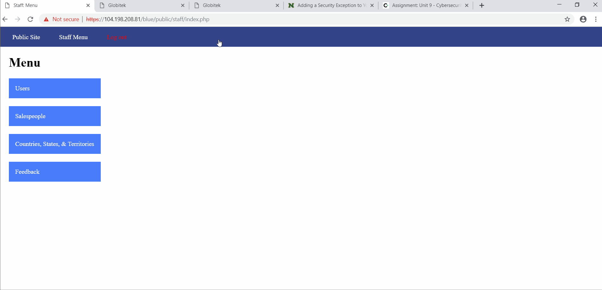

# CyberSecurity-week9
WELCOME 
# Project 8 - Pentesting Live Targets

Time spent: **10** hours spent in total

_> Objective: Identify vulnerabilities in three different versions of the Globitek website: blue, green, and red._

The six possible exploits are:
* Username Enumeration
* Insecure Direct Object Reference (IDOR)
* SQL Injection (SQLi)
* Cross-Site Scripting (XSS)
* Cross-Site Request Forgery (CSRF)
* Session Hijacking/Fixation

Each version of the site has been given two of the six vulnerabilities. (In other words, all six of the exploits should be assignable to one of the sites.)

## Blue

Vulnerability #1: SQL Injection (SQLi)
  - [x] GIF Walkthrough: 
    
  - [x] Steps to recreate:
    - The exploit exists in the salesperson.php page.
    - The exploit is done via the url.
    - Using SQL injection to the id attribute of each section (Blue, Green and Red), we can see from above that trying to break by 
       ```' OR 1=1'--  ```in the Blue site we receive the message "Database query failed."But for the Red and Green sections the SQL       injection statement redirected the screen and it cannot do any change to them

Vulnerability #2: Session Hijacking/Fixation
  - [x] GIF Walkthrough: 
    
  - [x] Steps to recreate:
     - Login in to the Blue site, and once logged in change the url to ```public/hacktools/change_session_id.php``` (provided in week        9- hints). Also, from this the session ID is retreived
     - The attacker changes the session ID using the provided change_session_id.php.
     - The attacker is now able to access the victims session.
     - This hacking method demonstrates that the session can be hijacked and user informations can be stolen
## Green

Vulnerability #1: Username Enumeration
  - [x] GIF Walkthrough: 
    
  - [x] Steps to recreate:
     - The GIF illustrates that when you enter in a username that exisits in the system/database along with a random password and you          inspect the page the class of the span HTML attribute is ```failure ``` Also, when a wrong username/ a username that isn't in          the system is entered with a random password, inspect will display ```failed```
     - Also,using the given username "jmonroe99" we can see that a valid username shows a bold error.
     - An incorrect username shows a not-bolded error
  
Vulnerability #2: Cross-Site Scripting (XSS)
  - [x] GIF Walkthrough: 
    
  - [x] Steps to recreate:
  - In the Red,Blue and Green site, click on Contact Us and enter into the form, where in the Feedback textbook write an alert script such as```<script>alert('RONA found the XSS!')</script>```. Then login and from there, click on Feedback on the dashboard and notice how you will encounter your Feedback pop-up window, only in the _Green Section._
  
Vulnerability #Bonus: Cross-Site Scripting (XSS)
  - [x] GIF Walkthrough: 
    
  - [x] Steps to recreate:
    -  In the Green site, go to Feedback and fill in the form along with a redirect script write in the Feedback textbox like for          instance: ```<script>document.location="https://www.facebook.com"</script>.``` Then go to login and click Feedback and you              will encounter Feedbacks from others and your feedback(a pop-up window XSS) which then directs you to the link you wrote in the        Feedback text box. As seen in the GIF, it directs me to my facebook page. 
  
  
## Red

Vulnerability #1: Insecure Direct Object Reference (IDOR)
   - [x] GIF Walkthrough: 
    
  - [x] Steps to recreate:
    - By directly ```changing the 'id' parameter in the URL``` in the Green,Red and Blue site,we can find salespersons not mentioned       on the page.
    - Find sales person/people that is/are not listed in the``` Find a Salesperson.```
    - Click on an exisiting salesperson and in the url set the id parameter to different id number such as ```9, 10, 11...```
    - Notice how nothing shows in the green and blue site when we change the id parameter. 

Vulnerability #2: Cross-Site Request Forgery (CSRF)
  - [x] GIF Walkthrough: 
    
  - [x] Steps to recreate:
  -  One of the three sites does not have CSRF protections on the admin area. We could design a form which would automatically submit       form data to the staff area and take advantage of a logged in user's access permissions.
  -  We can Design a form which will make a change to the spelling of some database content. (For example, change the first user from        "Jim" to "Jimaa")
   -   We can see from the GIF that the user who doesn't have admin privilege can still access the website's data and change it.

+HTML FORM for CSRF+

- [x] GIF Walkthrough: 
    
  - [x] Steps to recreate:
    - Use Burp 
    - The attacker submits a malicious webpage into the feedback section.
    - The victim visits the url from the feedback.
    - The malicious webpage silently submits a form to the edit section of the victims page
  

```<html>
  <!-- CSRF PoC - generated by Burp Suite Professional -->
  <body>
  <script>history.pushState('', '', '/')</script>
    <form action="https://104.198.208.81/red/public/staff/users/edit.php?id=1" method="POST">
      <input type="hidden" name="csrf&#95;token" value="aaa" />
      <input type="hidden" name="first&#95;name" value="Jim" />
      <input type="hidden" name="last&#95;name" value="Munroe" />
      <input type="hidden" name="username" value="jmonroe99" />
      <input type="hidden" name="email" value="test&#64;test&#46;com" />
      <input type="hidden" name="previous&#95;password" value="" />
      <input type="hidden" name="password" value="" />
      <input type="hidden" name="confirm&#95;password" value="" />
      <input type="hidden" name="submit" value="Update" />
      <input type="submit" value="Submit request" />
    </form>
  </body>
</html>```


